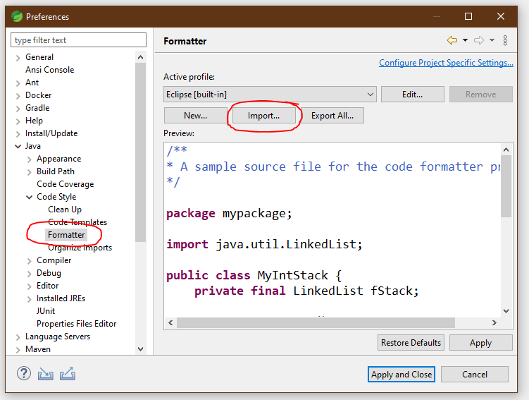

# itm-java-codeformat

Bietet die it@M Codeformatter Regeln für Java als Artefakt an, sodass diese von [Spotless](https://github.com/revelc/formatter-maven-plugin) automatisiert [während des Maven Builds](#Maven) geprüft (`mvn spotless:check`) bzw. umgesetzt (`mvn spotless:apply`) werden können.

## Verwendung

### IDE

[java_codestyle_formatter.xml](formatter/src/main/resources/itm-java-codeformat/java_codestyle_formatter.xml) herunterladen und speichern und anschließend in der IDE importieren.

Sowohl Eclipse als auch IntelliJ unterstützen den Import von Eclipse XML Profilen.

#### Eclipse
In den Einstellungen (`Window` - `Preferences`) im Reiter `Java / Codestyle / Formatter` mittels `Import` die Datei importieren und anschließend mit `Apply and Close` übernehmen.



#### IntelliJ
In den Einstellungen (`File` - `Settings`) im Reiter `Editor / Code Style / Java` unter den `Scheme Actions` mittels `Import Scheme - Eclipse XML Profile` die Datei importieren und anschließend mit `Apply` übernehmen und `Close` das Fenster schließen.


### Maven

Maven Plugin `spotless-maven-plugin` hinzufügen:

```xml
<plugin>
  <groupId>com.diffplug.spotless</groupId>
  <artifactId>spotless-maven-plugin</artifactId>
  <version>2.28.0</version>
  <dependencies>
    <dependency>
      <groupId>de.muenchen.itm</groupId>
      <artifactId>itm-java-codeformat</artifactId>
      <version>1.0.0</version>
    </dependency>
  </dependencies>
  <configuration>
    <java>
      <includes>
        <include>src/main/java/**/*.java</include> <!-- Check application code -->
        <include>src/test/java/**/*.java</include> <!-- Check application tests code -->
      </includes>
      <eclipse>
        <file>itm-java-codeformat/java_codestyle_formatter.xml</file>
      </eclipse>
      <trimTrailingWhitespace/>
      <endWithNewline/>
    </java>
  </configuration>
  <executions>
    <execution>
      <goals>
        <goal>check</goal>
      </goals>
    </execution>
  </executions>
</plugin>
```

Dadurch wird beim Build automatisch der Code auf Einhaltung der Formatierungsregeln überprüft (Goal `check`).

Weitere Einstellungen siehe [offizielle Plugin-Dokumentation](https://github.com/diffplug/spotless/tree/main/plugin-maven).

### Terminal
Eine Anwendung der Formatierungsregeln (-> Formattieren) kann manuell über `mvn spotless:apply` durchgeführt werden.

Eine Überprüfung der Formatierungsregeln kann ebenso manuell über `mvn spotless:check` durchgeführt werden.

## Contributing

Bei Änderungswünschen bzw. Änderungsbedarf bitte ein Issue erstellen.
